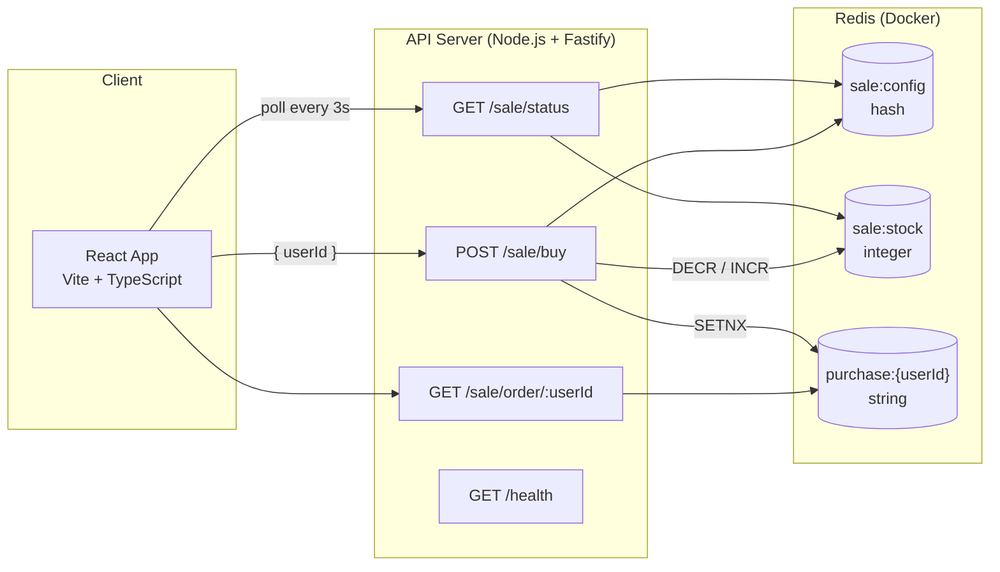
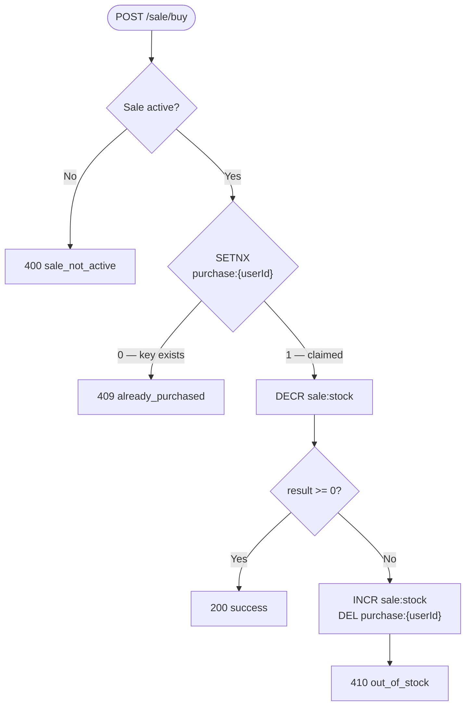

# flash-sale-api

Flash sale backend — Fastify + TypeScript + Redis, with a React frontend.

## System diagram



## Purchase flow



## Stack

- **Backend:** Node.js, Fastify, TypeScript, ioredis
- **Frontend:** React, TypeScript, Vite
- **Infrastructure:** Redis via Docker

## Setup

```bash
# Start Redis
docker-compose up -d redis

# Backend (runs on :3001)
cd backend && npm install && npm run dev

# Frontend (runs on :5173)
cd frontend && npm install && npm run dev
```

Sale defaults to starting 5 seconds after boot, running for 1 hour, with 100 items. Override with env vars:

```bash
SALE_START="2025-06-01T10:00:00.000Z" SALE_END="2025-06-01T11:00:00.000Z" SALE_STOCK=50 npm run dev
```

## API

| Method | Path                  | Description                     |
| ------ | --------------------- | ------------------------------- |
| GET    | `/sale/status`        | Sale state + remaining stock    |
| POST   | `/sale/buy`           | Purchase attempt `{ userId }`   |
| GET    | `/sale/order/:userId` | Check if user already purchased |
| GET    | `/health`             | Health check                    |

## How concurrency is handled

The main problem is preventing overselling when thousands of requests hit simultaneously. I went with two Redis atomic operations:

1. `SETNX purchase:{userId}` — only one request per user gets through; concurrent duplicates are rejected immediately
2. `DECR sale:stock` — atomic decrement, returns the new value. If it goes negative, we INCR it back and DEL the user key (rollback)

I considered a Lua script to wrap both ops atomically but it felt like overkill here. The rollback path only gets hit when the last few items are claimed, so the window is tiny. A queue approach (BullMQ etc.) would be cleaner for guaranteed ordering but adds latency that would feel bad for users in a flash sale.

No SQL DB — stock is just an integer, purchase records are key-value. Redis is the right fit. If this were production I'd async-persist orders to Postgres for receipts/history, but that's a separate concern from the transaction itself.

## Tests

```bash
# Unit (no Redis needed)
npm run test:unit

# Integration (needs Redis running)
npm run test:integration

# Stress — 1000 concurrent connections for 15s
# Start the server first, then:
npm run test:stress
```

The integration test includes a concurrency check: 20 simultaneous buyers for 5 items — exactly 5 should succeed and stock should end at 0, not negative.

The stress test reports p99 latency and confirms no overselling occurred.
